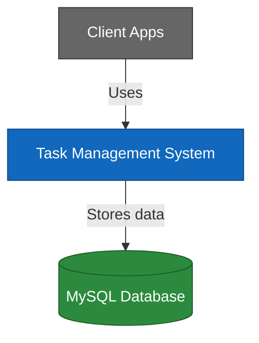
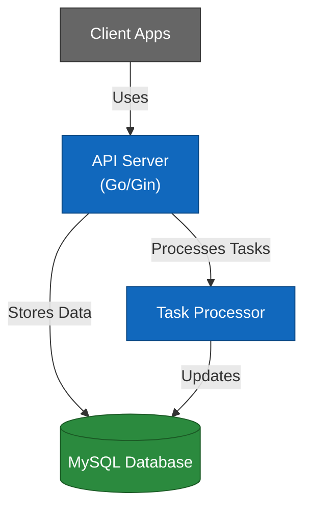
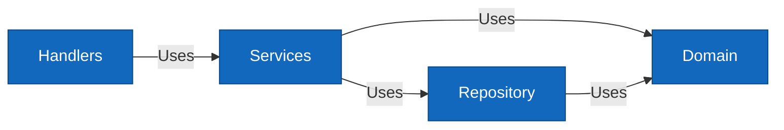
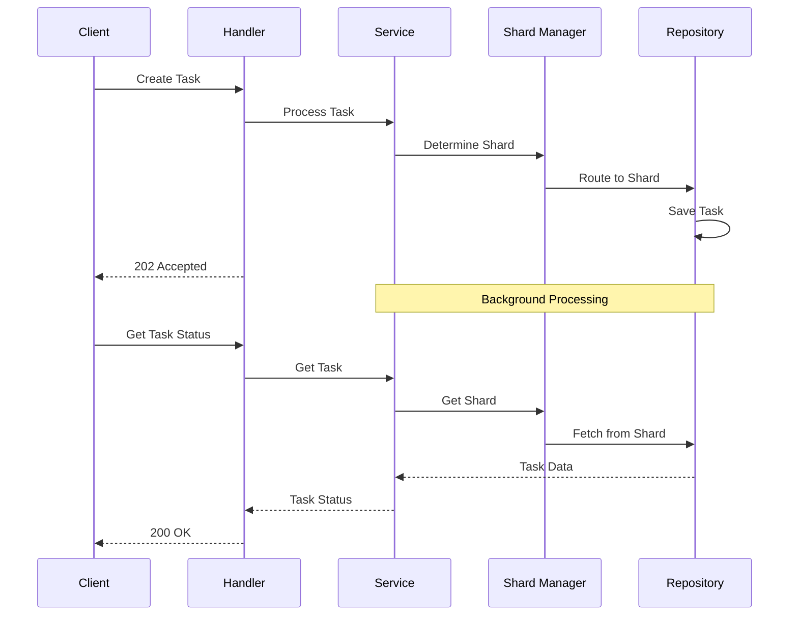
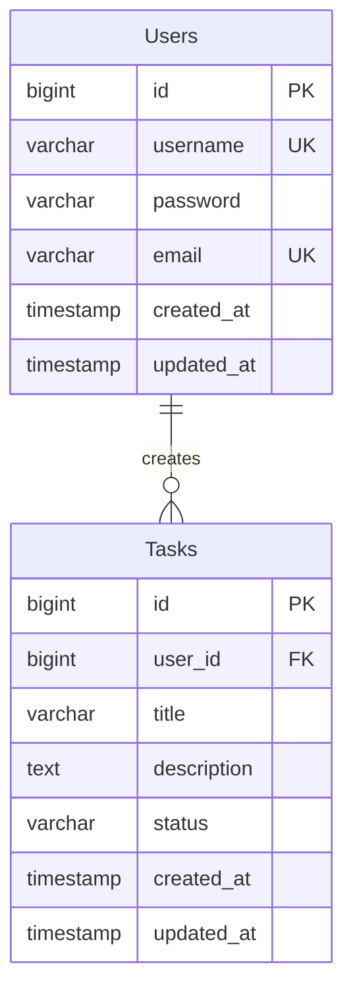

# Go Task Management API with Gin Framework

A robust and scalable task management API built with Go and the Gin framework, featuring JWT authentication, Swagger documentation, asynchronous task processing, and database sharding.

## Table of Contents

- [Architecture](#architecture)
- [Technologies Used](#technologies-used)
- [Getting Started](#getting-started)
- [Running the Application](#running-the-application)
- [API Documentation](#api-documentation)
- [Testing](#testing)
- [Project Structure](#project-structure)

## Architecture

### C4 Model Diagrams

#### System Context Diagram



#### Container Diagram



#### Component Diagram



### Sequence Diagram



### Database Architecture



The system uses a single MySQL database with the following features:

- **One-to-Many Relationship**: Each user can have multiple tasks
- **Indexing**: Optimized queries with indexes on frequently accessed columns (status, created_at, user_id)
- **Timestamps**: Automatic tracking of creation and update times
- **Status Management**: Pre-defined task states (pending, processing, completed, failed)
- **Data Integrity**: Foreign key constraints and unique constraints where appropriate

## Technologies Used

- **Go 1.24.3**: Main programming language
- **Gin Framework**: HTTP web framework
- **MySQL 8.0**: Database with sharding support
- **JWT**: Authentication
- **Swagger/OpenAPI**: API documentation
- **Docker & Docker Compose**: Containerization
- **GORM**: ORM for database operations
- **Consistent Hashing**: For database sharding
- **Viper**: Configuration management
- **Logrus**: Logging
- **Testify**: Testing framework
- **Docker**: Containerization
- **Shell Scripting**: Automation

## Getting Started

### Prerequisites

- Go 1.24.3 or later
- Docker and Docker Compose
- MySQL 8.0 or later (if running locally)

### Installation

1. Clone the repository:

```bash
git clone git@github.com:Khaled12208/GoLangWithGinProject.git
cd GoLangWithGinProject
```

2. Install dependencies:

```bash
go mod download
```

3. Install Swagger:

```bash
go install github.com/swaggo/swag/cmd/swag@latest
```

## Running the Application

### Local Development (Default & Recommended)

Start the application with Swagger UI:

```bash
./run.sh local
```

To stop all services:

```bash
./run.sh stop
```

To clean up resources:

```bash
./run.sh clean
```

Swagger UI will be available at: http://localhost:8888/swagger/index.html

## API Documentation

- Swagger UI: http://localhost:8888/swagger/index.html
- Postman Collection: [Link to Postman Collection](./postman/GoLangWithGin.postman_collection.json)

### Main Endpoints

- POST `/api/v1/register`: Register a new user
- POST `/api/v1/login`: Login and get JWT token
- GET `/api/v1/user`: Get user profile
- PUT `/api/v1/user`: Update user profile
- POST `/api/v1/tasks`: Create a new task
- GET `/api/v1/tasks`: List all tasks
- GET `/api/v1/tasks/:id`: Get task by ID

## Testing

Run different types of tests using the script:

```bash
# Run unit tests
./run.sh test

# Run integration tests
./run.sh integration

# Run all tests with coverage
./run.sh test-all

# Generate coverage report
./run.sh coverage
```

## Project Structure

```
.
├── cmd/                  # Application entrypoints
├── config/              # Configuration files
├── docs/               # Swagger documentation
├── internal/           # Private application code
│   ├── app/           # Application setup
│   ├── domain/        # Domain models
│   ├── repository/    # Data access layer
│   ├── service/       # Business logic
│   └── utils/         # Utilities
├── pkg/               # Public libraries
├── scripts/           # Helper scripts
└── tests/             # Test suites
```

```
 _  __  _   _    _    _     _____ ____
| |/ / | | | |  / \  | |   | ____|  _ \
| ' /  | |_| | / _ \ | |   |  _| | | | |
| . \  |  _  |/ ___ \| |___| |___| |_| |
|_|\_\ |_| |_/_/   \_\_____|_____|____/
```

## License

This project is licensed under the MIT License - see the LICENSE file for details.
